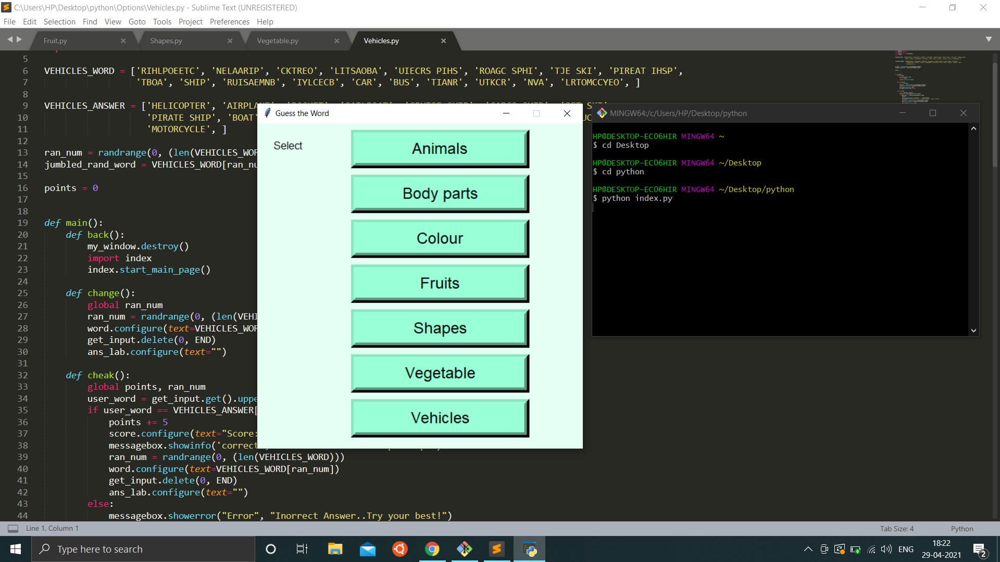
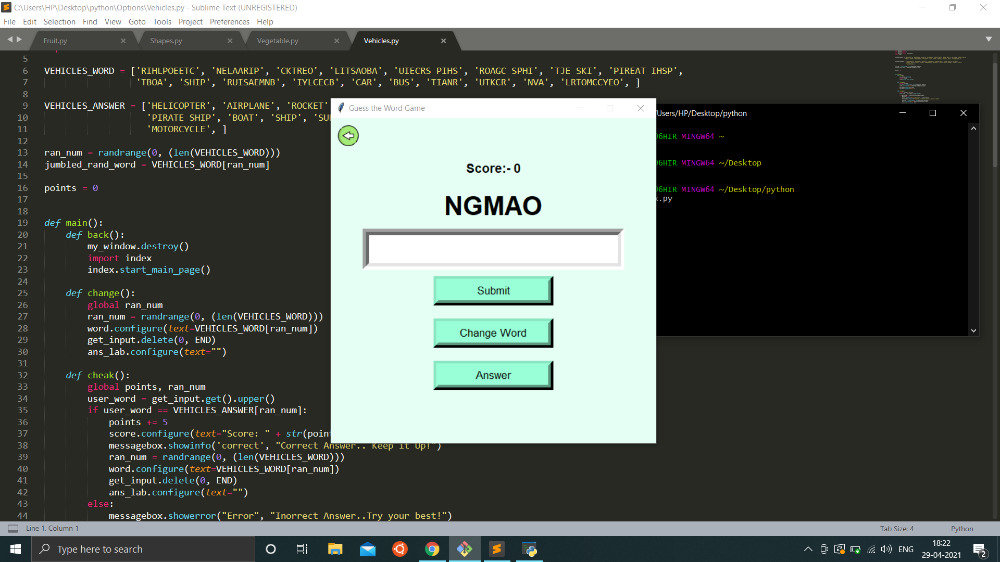
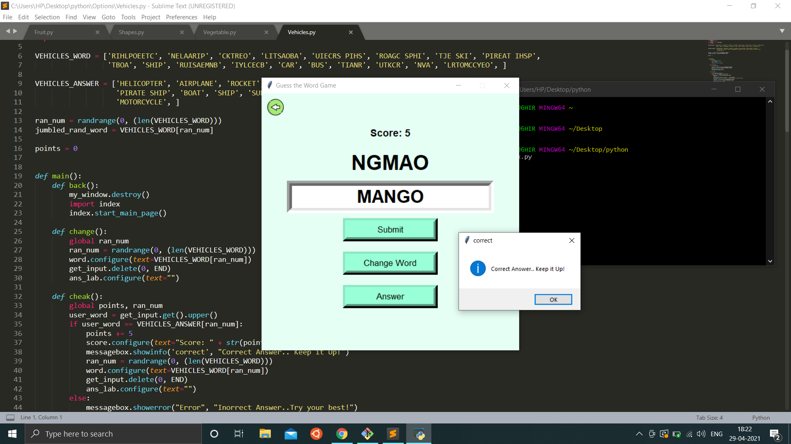

# OUTPUT OF THE PROJECT:

* This is the main page of the game, where the start button is present.

  
  
* This is the next screen where you can choose the category

  

* Now i select fruits as my choice and the next screen appears.

  
  
* On guessting the correct answer, we get:

  
