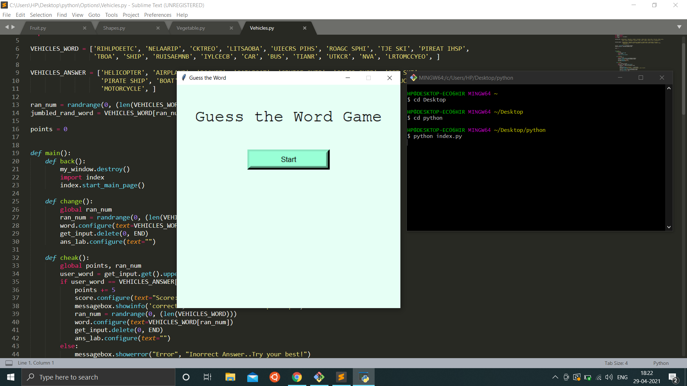

# OUTPUT OF THE PROJECT:

* This is the main page of the game, where the start button is present.

  
  
* This is the next screen where you can choose the category

  

* Now i select fruits as my choice and the next screen appears.

  
  
* On guessting the correct answer, we get:

  

* Another correct guess;

  
  
* Choosing the Animals option, the game goes like this:

  
  
  
  
* When i can't guess the word, and i click on the show answer button, i get not enough points, since showing the answer will take 5 points every time i click it.

  
